# Создание и настройка стенда на GNS3 для проведения лабораторных работ по сетевой безопасности

### Введение

В современном мире сетевая безопасность стала одним из ключевых аспектов в области информационных технологий. Для практического освоения принципов защиты сетей и систем, создание и настройка виртуального стенда являются важным этапом в обучении специалистов по сетевой безопасности. В этой статье мы рассмотрим шаги по созданию и настройке стенда на GNS3, популярной платформе для моделирования сетей, с целью проведения простых лабораторных работ по сетевой безопасности.

### Что такое GNS3?

**GNS3** (Graphical Network Simulator-3) — это программное обеспечение с открытым исходным кодом, которое моделирует сложные сети, максимально приближаясь к тому, как работают реальные сети. И все это без специального сетевого оборудования, такого как маршрутизаторы и коммутаторы.

#### **Архитектура**

GNS3 состоит из двух частей:

1.  Клиентская часть (GNS3-all-in-one)

    Представляет из себя графический интерфейс (GUI) в котором создаются топологии.
2.  Серверная часть

    Это ПО, на котором запускается эмуляция работы устройств из вашей топологии. Это может быть встроенный в клиентскую часть сервер, локальная или удаленная виртуальная машина.

В качестве серверной части рекомендуется использовать виртуальные машины, которые представлены для разных платформ (VMware, Virtualbox и т.д.). GNS3 может быть использован и без серверной части, но это сильно ограничивает его функции.

GNS3 поддерживает как эмуляцию, так и симуляцию устройств:

* **Эмуляция**: GNS3 имитирует или эмулирует аппаратное обеспечение устройства, и вы запускаете реальные ОС на виртуальном устройстве. Например, вы можете скопировать Cisco IOS с реального физического маршрутизатора Cisco и запустить его на виртуальном эмулируемом маршрутизаторе Cisco в GNS3.
* **Симуляция**: GNS3 имитирует функции и возможности такого устройства, как коммутатор. Вы используете не настоящие ОС (например, Cisco IOS), а скорее симулированное устройство, разработанное GNS3, например встроенный коммутатор L2.

### Установка GNS3

Первым делом требуется установить клиентскую часть GNS3 на вашем ПК. Последние версии под разные ОС находятся по [ссылке](https://www.gns3.com/software/download).

Инструкции по установке доступны в официальной документации: [Windows](https://docs.gns3.com/docs/getting-started/installation/windows), [Linux](https://docs.gns3.com/docs/getting-started/installation/linux), [Mac](https://docs.gns3.com/docs/getting-started/installation/mac).

Также нам понадобится установить [виртуальную машину GNS3](https://docs.gns3.com/docs/getting-started/installation/download-gns3-vm).

При написании этой статьи использовалась клиентская часть версии 2.2.45 и виртуальная машина для VMware Workstation с такой же версией. В качестве хостовой системы используется EndeavourOS (основан на Arch Linux).

### Настройка GNS3

При первом запуске откроется Мастер настройки.

<figure><figcaption>
Мастер настройки
</figcaption></figure>

Выбираем 1 пункт "Run appliances in a virtual machine", так как мы будем использовать виртуальную машину для эмуляции устройств и нажимаем Next. Откроется окно настройки локального сервера.

<figure><figcaption>
Настройки локального сервера
</figcaption></figure>

Здесь меняем Host binding на сеть VMware Host-only, так как GNS требует, чтобы локальный сервер работал в той же сети, что и виртуальная машина. Порт можно выбрать любой. В Linux-based системах лучше выбирать порт выше 1024, так как они не требуют для запуска root-прав. Нажимаем Next. Начнётся проверка локального сервера.

<figure><figcaption>
Проверка подключения к локальному серверу
</figcaption></figure>

Если вы всё правильно установили, то GNS3 напишет, что подключение прошло успешно. Нажимаем Next. Откроется окно настройки виртуальной машины.

<figure><figcaption>
Настройки виртуальной машины
</figcaption></figure>

Здесь выбираем VMware. Если вы уже импортировали GNS3 VM, то она отобразится в списке, если же вы этого ещё не сделали, то самое время скачать и импортировать её в VMware и после нажать Refresh. Вы можете установить любое число виртуальных ядер и памяти, для примера установлено 4 ядра и 16 Гб оперативной памяти. Нажимаем Next. Откроется окно подтверждения.

<figure><figcaption>
Подтверждение настроек виртуальной машины
</figcaption></figure>

Проверьте настройки и нажимайте Finish. Если вы сделали всё правильно, то в VMware должна была запустится виртуальная машина.

<figure><figcaption>
Окно VMware
</figcaption></figure>

### Главное окно GNS3

После настройки GNS3 должно открыться окно создания проекта. Если вы его случайно закрыли, или по какой-то причине оно не открылось, то его можно открыть вручную: File -> New Blank Project.

<figure><figcaption>
Создание нового проекта GNS3
</figcaption></figure>

Можете назвать свой проект как угодно. Я назову его sample\_project. После нажмите OK. Теперь доступно главное окно GNS3.

<figure>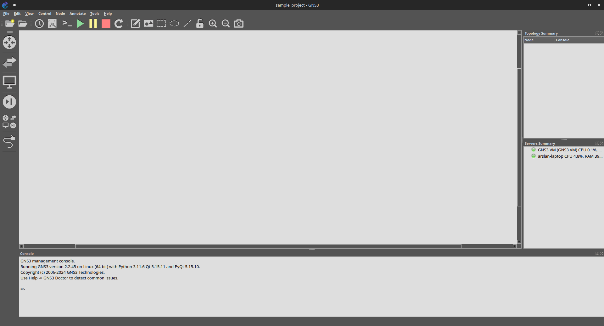<figcaption>
Главное окно GNS3
</figcaption></figure>

Окно содержит множество элементов, рассмотрим каждое из них.

#### **Рабочее пространство**

Рабочее пространство это окно, в котором создаются топологии.

<figure>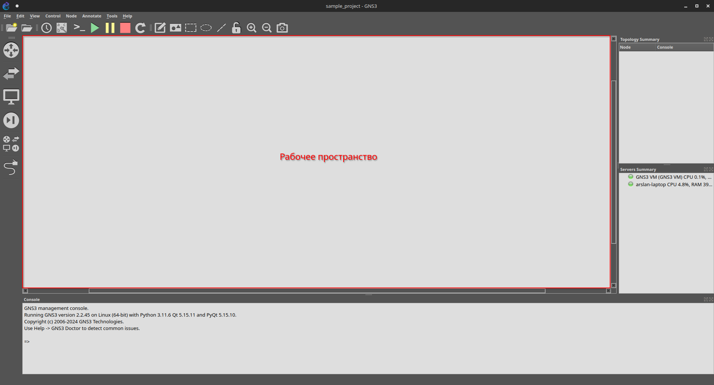<figcaption>
Рабочее простанство
</figcaption></figure>

#### **Панель инструментов**

Здесь представлены кнопки для быстрого доступа к инструментам.

<figure>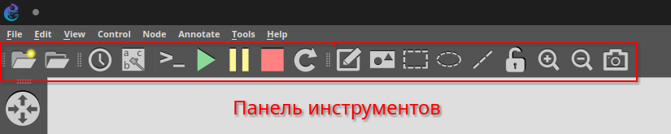<figcaption>
Панель инструментов
</figcaption></figure>

#### **Панель устройств**

Здесь представлены все устройства, которые могут быть в вашей топологии.

<figure>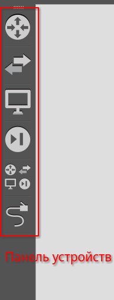<figcaption>
Панель устройств
</figcaption></figure>

Устройства сгруппированы в следующие группы:

<table><thead><tr><th width="100">Кнопка</th><th>Название</th></tr></thead><tbody><tr><td></td><td>Роутеры</td></tr><tr><td></td><td>Коммутаторы и хабы</td></tr><tr><td></td><td>Конечные устройства (ПК, Облако и т.д.)</td></tr><tr><td></td><td>Устройства безопасности</td></tr><tr><td></td><td>Все устройства</td></tr><tr><td></td><td>Добавить соединение</td></tr></tbody></table>

#### **Информация о топологии**

Здесь указаны все устройства в сети и их состояние (включено/выключено).

<figure>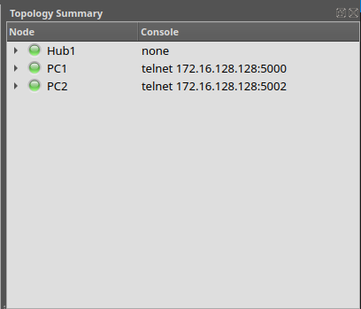<figcaption>
Информация о топологии
</figcaption></figure>

#### **Информация о серверах**

Если при установке и настройке вы сделали всё правильно, то в окне Servers Summary должны отображаться два сервера: локальный (на скриншоте arslan-laptop) и виртуальная машина (на скриншоте GNS3 VM). Также здесь отображается нагруженность серверов и какие устройства на них работают.

<figure>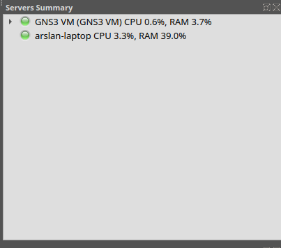<figcaption>
Информация о серверах
</figcaption></figure>

### Создание первой топологии

Создадим простую топологию:

* Три компьютера
* Один коммутатор

Компьютеры будут иметь статические IP-адреса, чтобы не требовался DHCP-сервер в сети.

Первым делом создадим три компьютера. Откроем группу End Devices в панели устройств и перетащим VPCS (Virtual PC Simulator) в рабочую зону.

<figure>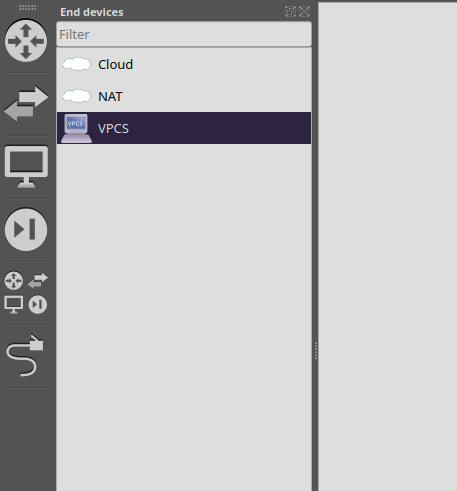<figcaption>
Группа End Devices
</figcaption></figure>

При добавлении устройства нам предлагают выбор сервера. Выбираем виртуальную машину.

<figure>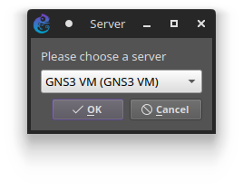<figcaption>
Выбор сервера
</figcaption></figure>

После добавления всех компьютеров, рабочая область должна выглядеть примерно так:

<figure>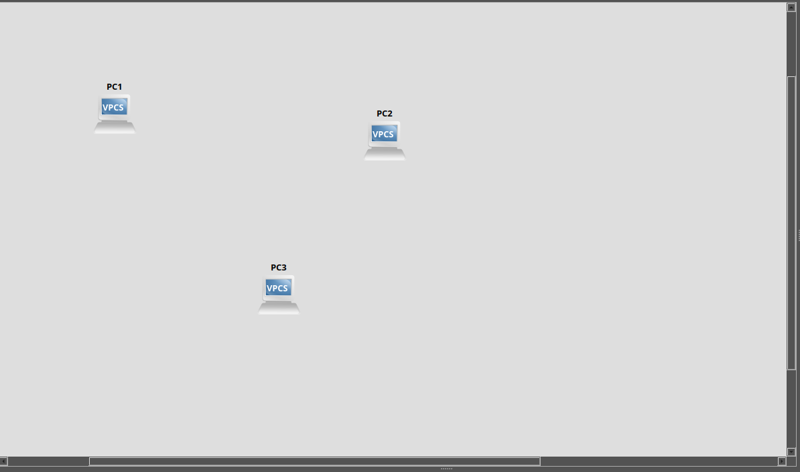<figcaption>
Топология с компьютерами
</figcaption></figure>

Добавим в топологию Ethernet Switch из группы Switches:

<figure>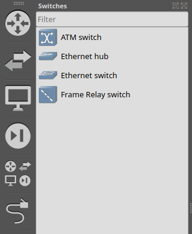<figcaption>
Группа Switches
</figcaption></figure>

Так же, как и при добавлении сервера, выбираем в качестве сервера нашу виртуальную машину. Сейчас рабочая область выглядит вот так:

<figure>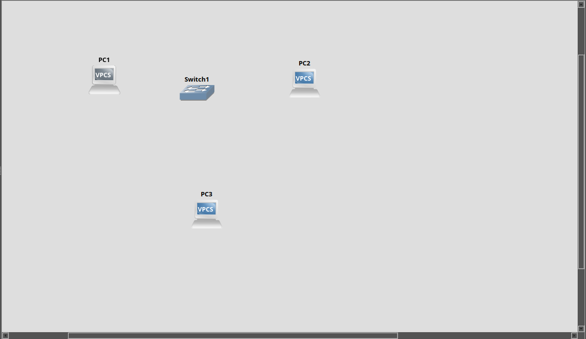<figcaption>
Топология с добавленным коммутатором
</figcaption></figure>

Теперь нам нужно добавить соединения между устройствами. В панели устройств выбираем Add a Link и нажимаем на PC1. Появится выбор порта. В случае с VPCS нам доступен только один порт.

<figure>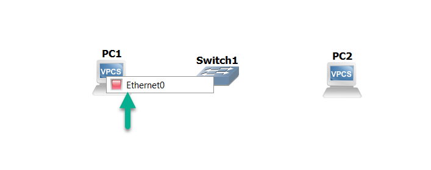<figcaption>
Выбор порта у PC1
</figcaption></figure>

Соединяем его со Switch1. Нажимаем на Switch1 и выбираем порт Ethernet0.

<figure>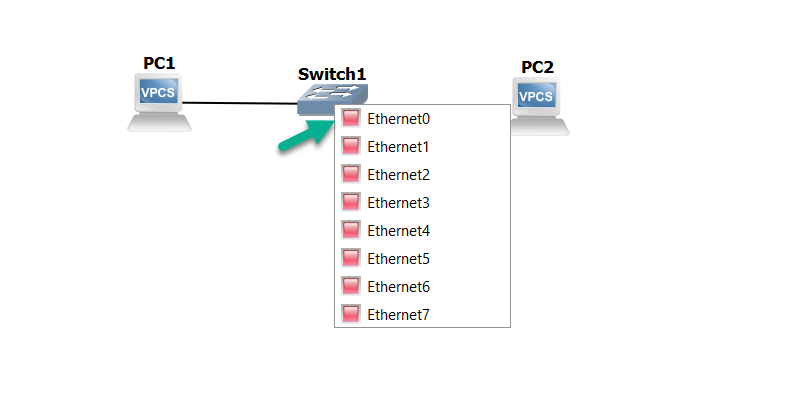<figcaption>
Выбор порта у Switch1
</figcaption></figure>

Мы успешно создали первую связь. Необходимо проделать то же самое с другими ПК. Должно получится следующим образом:

<figure>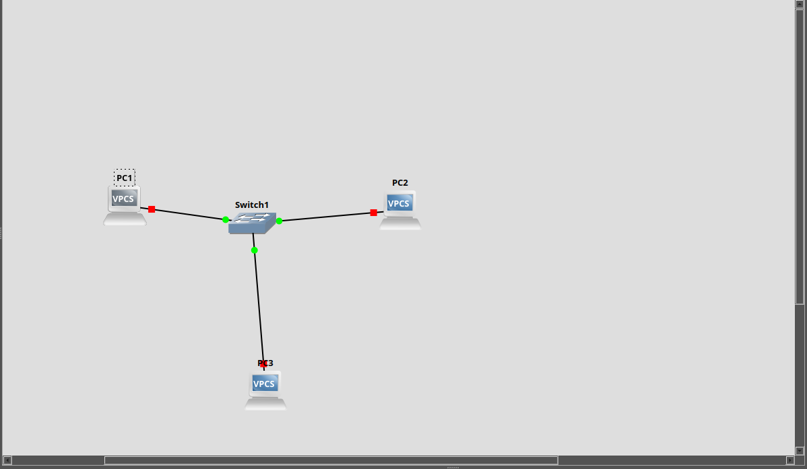<figcaption>
Топология со связями
</figcaption></figure>

Обратите внимание на цвета у связей. В таблице приведены все возможные цвета:

| Цвет    | Состояние                 |
| ------- | ------------------------- |
| Красный | Устройство выключено      |
| Жёлтый  | Устройство приостановлено |
| Зелёный | Устройство включено       |


**Примечание:** Если устройство помечено зелёным, то это ещё не значит, что порт находится в рабочем состоянии (он может быть выключен программно). Рекомендуется перепроверять, что порт включен через конфигурацию.


Запустим все устройства в топологии. Для этого нажмём кнопку Play в панели инструментов.

<figure>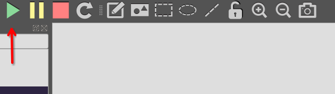<figcaption>
Запуск топологии
</figcaption></figure>

Все ПК в топологии стали активными, что видно по цвету связей и в информации о топологии.

<figure>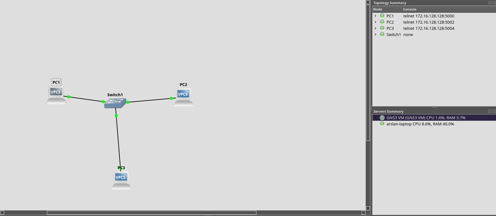<figcaption>
Запущенная топология
</figcaption></figure>

VPCS представляет собой очень упрощенное устройство, поэтому управлять им можно только через командную консоль.

<figure>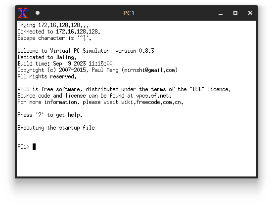<figcaption>
Консоль VPCS
</figcaption></figure>

Пусть все наши ПК находятся в одной сети 10.10.10.0/24. Назначим IP-адреса следующим образом

| Компьютер | IP-адрес   |
| --------- | ---------- |
| PC1       | 10.10.10.1 |
| PC2       | 10.10.10.2 |
| PC3       | 10.10.10.3 |

В VPCS адреса назначаются через команду ip:

<figure>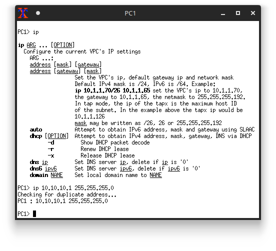<figcaption>
Установка IP-адреса у PC1
</figcaption></figure>

Проделаем это для остальных ПК в топологии:

<figure>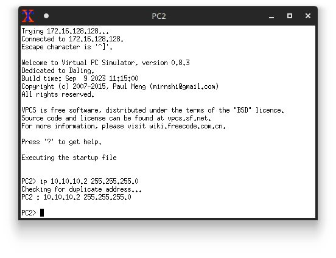<figcaption>
Установка IP-адреса у PC2
</figcaption></figure>

<figure><figcaption>
Установка IP-адреса у PC3
</figcaption></figure>

Проверим, что все ПК видят друг друга через команду ping:

<figure>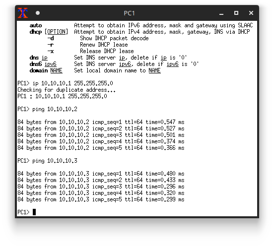<figcaption>
Команды ping на PC1
</figcaption></figure>

<figure>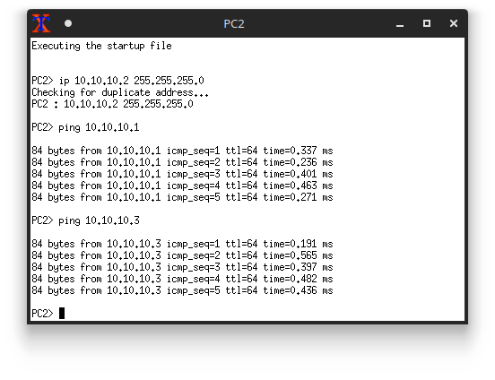<figcaption>
Команды ping на PC2
</figcaption></figure>

<figure><figcaption>
Команды ping на PC3
</figcaption></figure>

Если все пинги прошли успешно, то поздравляю, вы успешно создали **свою первую топологию** в GNS3!

### А что дальше?

На самом деле, с помощью стандартных устройств GNS3 нужные топологии не сделать. Есть [специальный сайт](https://gns3.com/marketplace/featured), где представлено множество устройств, преднастроенных проектов и ПО. Установка выходит за рамки статьи, но есть [туториал](https://docs.gns3.com/docs/using-gns3/beginners/import-gns3-appliance/).

Ещё рекомендую вам самим изучить [документацию к GNS3](https://docs.gns3.com/docs/), так как она содержит много полезных вещей, которые были опущены в статье.

### Заключение

В этой статье мы разобрали, как установить GNS3 с виртуальной машиной, как их настроить и как сделать свою первую топологию. Надеюсь, что она вам пригодится в рамках выполнения лабораторных работ по сетевой безопасности.
